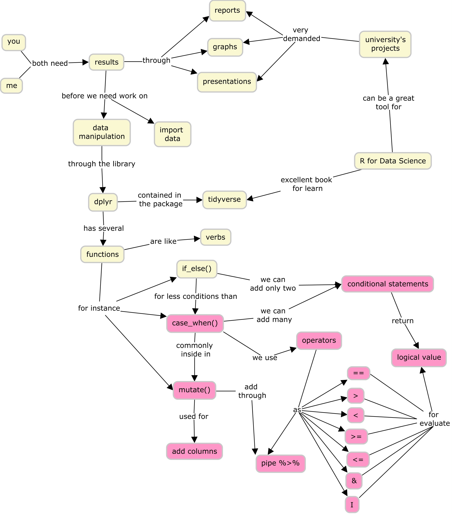

# Rstudio Certification Teaching

## About the class

As in the last lesson, we work with a tibble called `data`, which have 5 columns: 

  - planet
  - diameter
  - ring
  - num_moon
  - mass
  
## 1. Learner persona

### General background:

Sayén studies astronomy is in the last year of her program. Also, she works as an assistant teacher called "astronomy and statistics"; which combine theoretical and applied concepts.

### Relevant experience:

Sayén uses R since three years ago. In the last semester, she participates in an introductory workshop for tidyverse. In particular, she knows import data and makes graphs. In this semester, she participates in the intermediate workshop for tidyverse. In the chapter working with data, in the last lesson, she learns if_else() function.  
  
### Perceived needs:

Sayén knows that is important to manipulate data to develop the university's projects and then R is a great tool. Also, her family do not understand clearly what she does, so it's great how they visualizations can help to talk with her family about her studies.

### Special considerations: 

Sayén is very shy, she does not believe so much in her capacities and suffers from impostor syndrome in discussions about R. 

## 2. Concept map

[Conceptual map](https://github.com/jariffo/Rstudio_Certification_Teaching/blob/main/Graph_case_when.jpg)

## 3. Formative Assessment

[Two questions](https://javiera-riffo-torres.shinyapps.io/Prueba_formativa/)

## 4. Slides

[Slides](https://github.com/jariffo/Rstudio_Certification_Teaching/blob/main/docs/Clase_case_when.Rmd)

