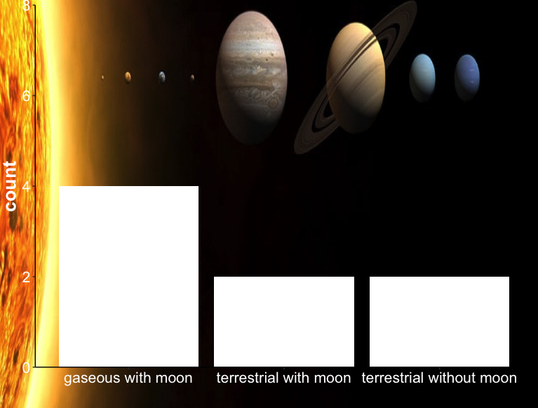

layout: true
  
<div class="my-footer"><span>

</span></div> 


```{r include=FALSE}
library(tidyverse)
library(here)
library(readr)
#devtools::install_github('yihui/xaringan')
```

<!-- 
-->


---
class:
##  Remember our last lesson

  - __Manipulation data with `if_else()`__
```{r eval=FALSE}
data %>%
  mutate(
    planet_composition = if_else(ring == TRUE, "gaseous", "terrestrial"),
    moon = if_else(num_moon > 0, "with moon", "without moon")
  )
```


---
class:
###  At the end of this lesson...


```{r out.width = "70%", echo=FALSE, fig.align="center"}

```


---
class:
####  Remeinder:

0. __Packages__
  - `library(dplyr)` : manipulation on data

1. __Main Function__
  - `case_when()`
  
2.  __Operators__
  - `&` : and 
  - `|` : or
  - `=` :  assign values to arguments in function calls
  - `==` : used for equality testing
  - `>`, `<`, `<=`, `>=`: greater than, less than, less than or equal to, greater than or equal to

3. __Functions in__ `dplyr`
  - `mutate()` add column and put ir a name
  - `%>%` : pipe operator `x %>% f(y) = f(x,y)` 

  
  
---
class:

###  Function `case_when()`
```{r out.width = "105%", echo=FALSE, fig.align="center"}
knitr::include_graphics("img/case_when_function.png")
```

---
class:

###  Function `case_when()` + `mutate()`

```{r out.width = "100%", echo=FALSE, fig.align="center"}
knitr::include_graphics("img/case_when_arguments.png")
```


---
class:
<center>
<font size="145"> Live coding</font>
</center>

```{r eval=FALSE}
library(tidyverse)
#Cmd/Ctrl + Option + I insert chunck
#Cmd/Ctrl + Shift + R insert section
# Ejercicio 1 -------------------------------------------------------------
#Crear una lista denotada como altura
altura <- c(1.7, 1.5, -1.8, 1.2)
#Crear un vector de comparacion
altura_comp <- case_when(
  altura > 1.5 ~ "muy alto",
  altura == 1.5 ~ "normal",
  altura < 0 ~ "dato mal ingresado",
  altura < 1.5 ~ "bajo",
)
altura_comp

# Ejercicio 2 -------------------------------------------------------------

# data <-  readxl::read_excel("datos_planetas.xlsx")
#La base de datos <data> ha sido cargada para ti previamente
head(data)
```

---
class:

<center>
<font size="145">  Now it's your turn</font>
</center>

```{r out.width = "50%", echo=FALSE, fig.align="center"}
knitr::include_graphics("img/thinking.jpg")
```

#### 	Exercise

https://javiera-riffo-torres.shinyapps.io/Prueba_formativa/

---
class:

<font size="145"> Congratulations! </font> 

You have learn a new function `dplyr::case_when()`

```{r out.width = "50%", echo=FALSE, fig.align="center"}
knitr::include_graphics("img/good_job.jpg")
```

---
class:
####  Homework challenge

```{r out.width = "50%", echo=FALSE, fig.align="center"}

```

Replicate this plot

__Hints__

  - `require(ggimage)`
  - `library(ggforce)`
  - `library(janitor)`
  - `ggimage::ggbackground(p, img)`, where `p` is your plot and `img = "docs/img/Planets.pdf"`

---
class:
#### Bibliography


