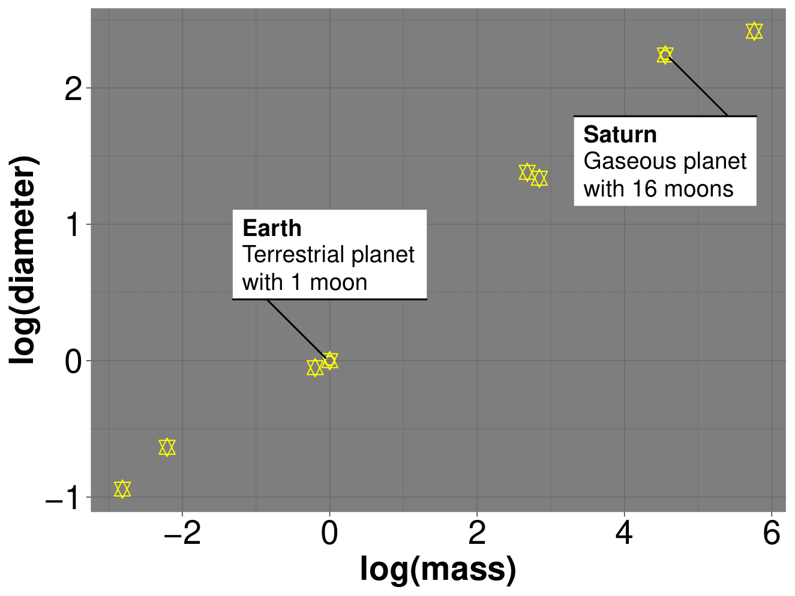
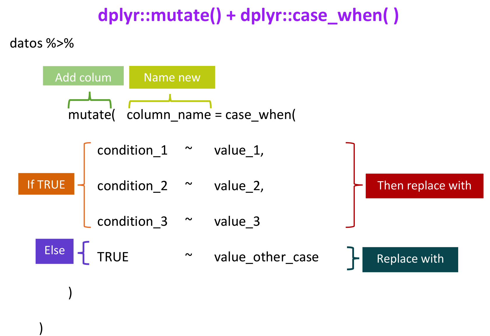
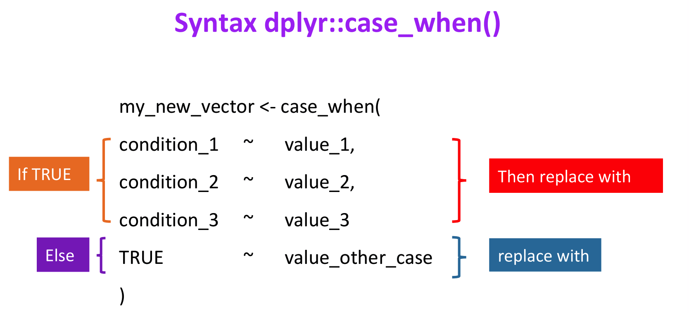
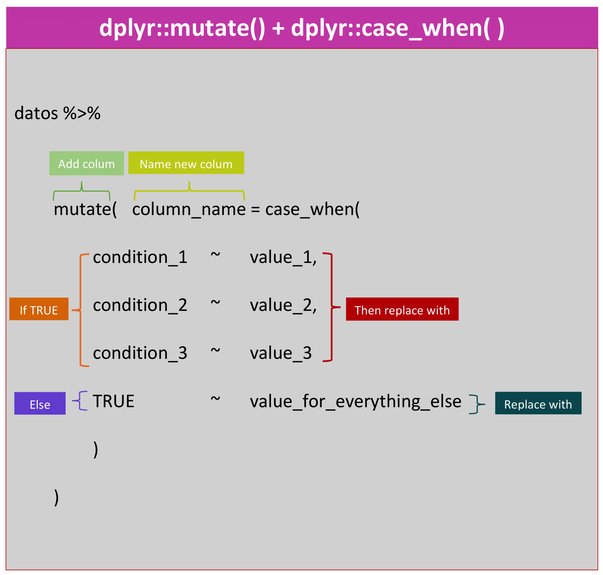

layout: true
  
<div class="my-footer"><span>

</span></div> 


```{r include=FALSE}
library(tidyverse)
library(here)
library(readr)
#devtools::install_github('yihui/xaringan')
```

<!-- 
-->


---
class:

###  Remember our last leason

  - __Dataset__
  
```{r , width = "5%", eval=TRUE, echo=FALSE, comment=NA}
data <-  readxl::read_excel("datos_planetas.xlsx")
d1 <- data %>% 
  filter(planet == "Earth" | planet == "Saturn")
knitr::kable(d1)
```


---
class:
###  Remember our last lesson

  - __if_else__
```{r eval=FALSE}
data %>%
  mutate(
    planet_composition = if_else(ring == "TRUE", "gaseous", "terrestrial"),
    moon = if_else(num_moon > 0, "with moon", "without moon")
  )
```
__`Q1: But, How evaluate more than two conditions?`__

  -   __Visualizations__ 
```{r out.width = "40%", echo=FALSE, fig.align="center"}

```

__`Q2: But, How to count terrestrial or gaseous planets with or without moon?`__

---
class:
### Now in this lesson

__`The answer is case_when function`__


`?case_when`

```{r out.width = "100%", echo=FALSE, fig.align="center"}

```


---
class:
###  Now, In this lesson
```{r out.width = "70%", echo=FALSE, fig.align="center"}
knitr::include_graphics("img/Rplot07.png")
```

#### Conditional sentences

For instance:
  - __IN CASE__ `ring` = TRUE __AND__ `num_moon` = 0 __THEN__  gaseous without moon

---
class:
####  Remeinder:

0. __Packages__
  - `library(dplyr)` : manipulation on data

1.  __Operators__
  - `&` : and 
  - `|` : or
  - `=` :  assign values to arguments in function calls
  - `==` : always used for equality testing
  - `>`, `<`, `<=`, `>=`: greater than, less than, less than or equal to, greater than or equal to

2. __Functions in__ `dplyr`
  - `mutate()` add column and put ir a name
  - `%>%` : pipe operator `x %>% f(y) = f(x,y)` 

- We see `case_when()`
  
  
---
class:

####  Function `case_when()`
```{r out.width = "85%", echo=FALSE, fig.align="center"}

```

---
class:

####  Function `case_when()` + `mutate()`

```{r out.width = "80%", echo=FALSE, fig.align="center"}

```

---
class:
### Examples 
####  `dplyr::case_when()` 
```{r }
diameter <- c(0.39, 0.95, 1, 0.53, 11.2, 9.41, 3.98, 3.81)
planet_size <- case_when(diameter > 1 ~ "bigger than Earth",
                         diameter < 1 ~ "less than Earth",
                         TRUE ~ "Earth")
```

####  `dplyr::case_when()` and `dplyr::mutate()`
```{r eval =FALSE}
data %>%
  mutate(
    planet_size =
      case_when(
        diameter > 1 ~ "bigger than Earth",
        diameter < 1 ~ "less than Earth",
        TRUE ~ "Earth"
      )
  )
```

---
class:

<font size="145">  &nbsp;   &nbsp;  &nbsp; &nbsp;  &nbsp; Now It's your turn!</font>


```{r out.width = "50%", echo=FALSE, fig.align="center"}

```

#### 	Exercise

https://javiera-riffo-torres.shinyapps.io/Prueba_formativa/

---
class:

<font size="145"> Congratulations! You have learn a new function dplyr::case_when() </font> 


```{r out.width = "50%", echo=FALSE, fig.align="center"}

```

---
class:
<font size="125">  Homework challenge:  </font> 

```{r out.width = "70%", echo=FALSE, fig.align="center"}
knitr::include_graphics("img/Rplot07.png")
```

Replicate this plot

__Hints__

  - `require(ggimage)`
  - `library(ggforce)`
  - `library(janitor)`
  - `ggimage::ggbackground(p, img)`, where `p` is your plot and `img = "docs/img/Planets.pdf"`


